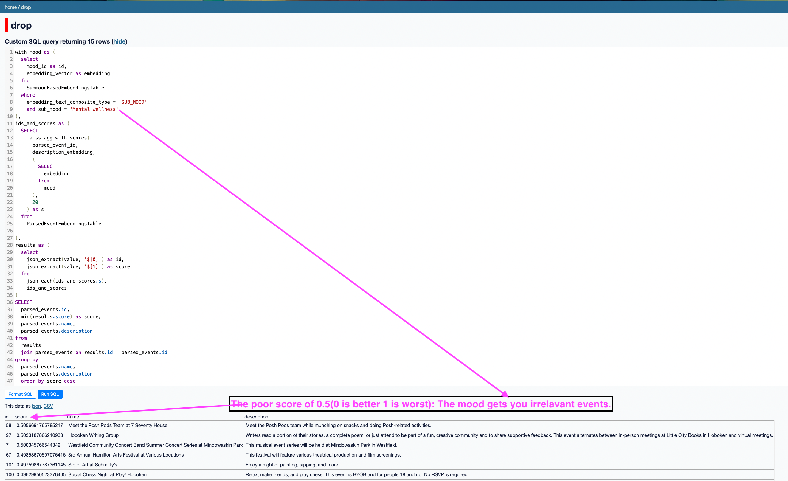

# poc_drop_content_search
The idea is to use this framework as a test bed for testing drop's prompt's data quality(for now limited to textual prompts).
Lots of pieces are still missing; 
- The ranking is generic and based on content personalized, there is no social graph.
- The examples in this PoC are not the final prompts(In the real app there will be a BFF(Conversational ChatGPT like api) that will intercept the data and actually polish/rank/filter and serve the prompts). 


Tech wise the PoC is to ingest text content into a vector database from which we can retrieve relevant search results(i.e. the bread and butter of prompts) given a NL Query which we call a "[mood](./main/model/mood_seed.py)" which we will infer or generate(seed). 

There are a few core ideas of we do want to demonstrate:
1. To a fair extent we can extract structured information from unstructured web content using OpenAIs API. For example the `event_json` column is a JSON of facts extracted from the `original_event` data scraped from the web:
 column is retrieved from unstructured text using a prompt.

2. Generate seed moods for a locality(Hoboken or South Bangalore) to start off.

3. We can use embeddings from OpenAI API to emnde data from steps 1, 2 (see the embeddings table in drop.db) the purpose is to find similarity 
in a dataset using FAISS [Vector search](https://datasette.io/plugins/datasette-faiss):
 There is nothing new about embeddings and vector databases. What is new is we *dynamically index* a subset of the data and query it repeatedly using 
datasett-faiss. At scale we can do this using commercial vector databases like PineCone. But you will be surprised at how far SQLite can go :). The need for dynamic index comes from  the so called interaction, which I imagine can come from user cues from our Shared space or from the Context and happens repeatedly.

3. TODO: We can order the events in a reverse spatial-cronological order.
- The events are always ordered into two buckets "Here" and "Later" and then sorted by spatial distance. 
This is not hard to do once we know what is relevant to the mood.

4. TODO: Lead into how we can go from issues we Cold start towards improving the quality of content retrieved using
a ML NLP model.

# UPDATE (14th July): 
Play with the database: The database [dump](https://www.dropbox.com/home/project_drop) can be visualized using datasette:

Install [datasette](https://datasette.io/) in the python virtual env and just say `datasette drop.db`.

This is what you should see: 


# Lay of the land 
## Data Extraction Flow
Always start with the data first and play with it to get a good feel of what it looks like. *THEN* comes the ML/AI play.
```
Scrape and Ingest data -> Post Process Data -> Extract Events*        -> Embedding
     |                        |                    |                        |
  Local File                Local File          SQLLite            SQLLite(or a Vectorstore)
```


## Code base layout:
- Core data structure for `Event` is: `main/model/types.py`
- Prompts for extraction are in `main/prompts/hoboken_girl_prompt.py`
- AI and DB utilities are in `main/utils/ai.py` and `main/utils/db.py` along woth other utility functions
-  Main executable is a CLI interface in `main/hoboken_girl_extraction.py`

## After setting up virtualenv/pyenv you can
Run:
`python main/hoboken_girl_extraction.py --help`
You will see three commands that are explained in the flow above.
```
╭─ Commands ──────────────────────────────────────────────────────────────────────────────────────────────╮
│ extract-serialize-events                            Call parse_events and get                           │
│ ingest-urls                                                                                             │
│ post-process                                                                                            │
╰───────────────
```

# What each step of the Flow does.

# 1. Ingest URLs will scrape hoboken girl web page:
Potentially other web page that has content, but script might need tuning.
## Example command:
```
python main/hoboken_girl_extraction.py ingest-urls /Users/sid/workspace/scraping/examples/ https://www.hobokengirl.com/hoboken-jersey-city-events-june-30-2023/ https://www.hobokengirl.com/hoboken-jersey-city-events-june-23-2023/ --run-prefix test
```
will scrape two pages(internally using BeautifulSoup and requests)

# 2. Post Process command: 
We feed the events from scraped text into GPT API one by one so we need to put a delimiter between events in the text. This is Specific to hoboken girl data where all events are in one file and I need to separate them. The step is simple it delimits each event  using some heuristic pattern recognition i.e. it places the `$$$` delimiter between events to consume them one at a time for next step in the flow(see [this](https://github.com/itissid/poc_drop_content_search/blob/be022ad969598ec768a7d8836f9bc8131325d1aa/examples/postprocessed/hobokengirl_com_hoboken_jersey_city_events_june_23_2023_20230704_170142_postprocessed.txt) file)
Since its heuristic one need to double check if all events have been delimited(~90% of the events from HG are processed fine). It makes athe manual correction that the pattern made much easier. 

## Example command :
```
>> python main/hoboken_girl_extraction.py post-process  ~/workspace/scraping/examples/test_ingestion/hobokengirl_com_hoboken_jersey_city_events_june_30_2023_20230704_170142.txt
```

# 3. Extract Events(Use AI!)
> YOU WILL NEED AN OPEN AI KEY.  https://openai.com/pricing

## Example command is :
```
python main/hoboken_girl_extraction.py extract-serialize-events 2023-05-23 --cities Hoboken --cities JerseyCity --ingestable-article-file ~/workspace/scraping/examples/postprocessed/hobokengirl_com_hoboken_jersey_city_events_june_23_2023_20230704_170142_postprocessed.txt 
```

There will be errors in this process due to OpenAI timing out. In running this I
found that this errored in 2-3/100 data points, even with 10 retries and
exponentail back off. YMMV. But we need to eventually deal with the errors in data.  A dumb
way to do this is to keep retrying forever but that might take a long time for more than a
few 1000 examples. A more clever way is to use async frameworks like celery and
AMPQ to deal with the failures by queing them onto a retry queue and process them later. 

We record the failures in the database:

|description|event_json|truncated_event_raw_text                            |failure_reason                                                                                                                                                                                                                                                                         |truncated_filename|version|
|-----------|----------|----------------------------------------------------|---------------------------------------------------------------------------------------------------------------------------------------------------------------------------------------------------------------------------------------------------------------------------------------|------------------|-------|
|           |null      |Pride Run at Pier A Park   Saturday, June 24th &#124; ...|("Connection broken: InvalidChunkLength(got length b'', 0 bytes read)", InvalidChunkLength(got length b'', 0 bytes read))                                                                                                                                                              |hobokengi...      |v1     |
|           |null      |Marisa Monte at NJPAC   Friday, June 23rd    &#124; 8P...|("Connection broken: InvalidChunkLength(got length b'', 0 bytes read)", InvalidChunkLength(got length b'', 0 bytes read))                                                                                                                                                              |hobokengi...      |v1     |
|           |null      |Musical Cooking Class by One Great Vegan   Saturd...|That model is currently overloaded with other requests. You can retry your request, or contact us through our help center at help.openai.com if the error persists. (Please include the request ID f9414e90d044c6edf5b33ce1bcc5115c in your message.) (Error occurred while streaming.)|hobokengi...      |v1     |
|           |null      |State Fair Meadowlands at MetLife Stadium   Ongoi...|That model is currently overloaded with other requests. You can retry your request, or contact us through our help center at help.openai.com if the error persists. (Please include the request ID 69490a87a9700a07a206ca1900d0d305 in your message.) (Error occurred while streaming.)|hobokengi...      |v1     |
|           |null      |The Laugh Tour Comedy Club at Dorrian’s Red Hand ...|                                                                                                                                                                                                                                                                                       |hobokengi...      |v1     |

# 3.1 Generate the moods
This step is extremely hackish. We want to be able to use moods from the shared space that can retrieve relevant things for the user to see. The idea is encapsulated in the [PROMPT](./main/model/mood_seed.py)
variable where I gave it to ChatGPT to just generate moods for me. 

This is far from perfect since it results Missing or Overlapping data between moods. With our small dataset 
I have faced more of the Missing data than the overlapping issue. 


Poor score with moods(due to lack of data):



# 4. Use OpenAI Embeddings to create Embedding vectors
1. To create the embeddings for the moods in mood_seed.py use. Example: 
```
python main/hoboken_girl_extraction.py index-moods MILLENIALS
```
This creates a table called MoodJsonTable. 

Next we create embeddings for the moods.
```
python main/hoboken_girl_extraction.py index-mood-embeddings MILLENIALS
```

# 5. Demo!
Lets use the mood embeddings to find relevant embeddings. Check out [this](./example_retrieval.sql) script.
You should run it in the datasette browser after you have installed the plugin in your env.
Here are some of the results. Rule of thumb: below 0.36 distance the results are better:


